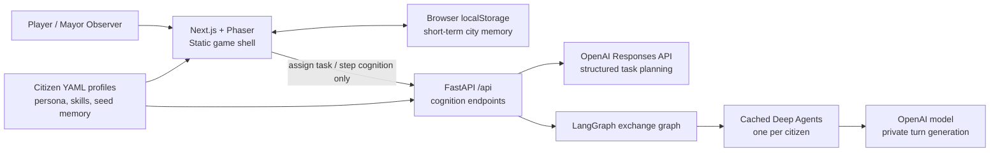
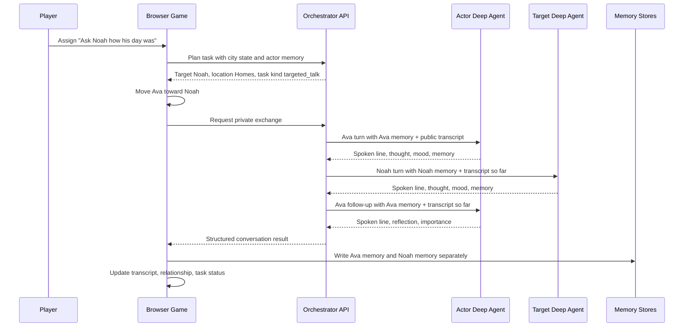
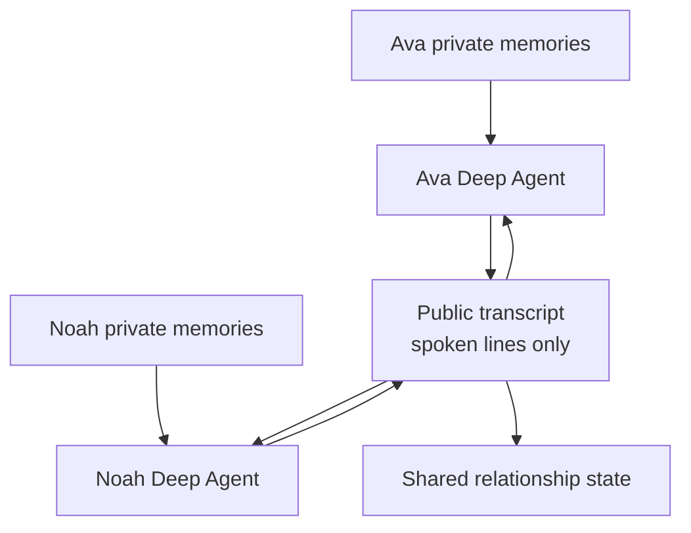

# AgentCity

AgentCity is a playable 2D AI city simulation where citizens are autonomous agents with daily routines, needs, money, relationships, memory, and goals. The current MVP intentionally focuses on five active student agents so the story is easy to follow before scaling back to the full city.

This repo is `ai-agent-city-game`. The visible product name is `AgentCity`.

Play online: https://ai-agent-city-game.vercel.app

## License

AgentCity is released under the [PolyForm Noncommercial License 1.0.0](LICENSE).
You may use, modify, and distribute it for non-commercial purposes. Commercial
use requires a separate commercial license from the project owner.

## Stack

- Frontend: Next.js, React, Phaser, Tailwind, shadcn-style primitives, Zustand
- Backend: FastAPI, Pydantic, SQLAlchemy
- Agent runtime: LangGraph + Deep Agents for private citizen exchange orchestration
- Realtime: WebSocket
- Memory store: browser short-term session memory by default, optional cloud Postgres + pgvector for durable memory
- LLM: OpenAI Responses API for strict structured turn generation
- Embeddings: OpenAI embeddings, default `text-embedding-3-small`

## Autonomy Direction

AgentCity uses a Hermes-inspired loop: citizens collect observations, retrieve memories, reason selectively, form plans, talk to nearby citizens, and write new memories back into the city. The linked Hermes Agent project is a useful reference for self-improving agents with persistent memory, skill learning, cross-session recall, scheduled automations, and subagents.

The live task/conversation path now uses LangGraph to run private exchange nodes and invokes a cached Deep Agent graph for each citizen turn. Each citizen turn receives only that citizen's private memory plus the public transcript so far. This prevents Ava from reading Mateo's memory, and it prevents Mateo from claiming he was invited to dinner unless Mateo actually remembers that or hears it in conversation.

Manual Mode is the easiest way to follow the game: the city waits, the player assigns one student task, the task runs, conversations/memories are written, and the city pauses when the task completes. Autonomous Mode starts the living-city loop: students follow routines, meet naturally, LLM cognition can generate conversations, and relationships shift from strangers to acquaintances to friends over time.

## How Agents Interact

Each citizen is both a visible game entity and a private AI actor. The game engine
handles mechanical state: clock ticks, map movement, location arrival, task status,
relationship scores, and memory writes. The AI layer handles cognition: deciding
who to approach, what to say, what the exchange means, and what each participant
remembers afterward.

The important rule is memory isolation. A citizen never receives another citizen's
private memory file. When Ava talks to Noah, Ava can use Ava's memories and the
public transcript. Noah can use Noah's memories and the same transcript. New facts
move through spoken lines, not hidden prompt leakage.

For a manual player task, the flow is:

1. Player assigns a natural-language task to one citizen.
2. The orchestrator asks OpenAI to turn the task into a plan: task kind, target
   citizens, route/location, and a player-visible summary.
3. The browser simulation moves the actor toward the selected target or location.
4. When the actor is ready, LangGraph runs the conversation as private turn nodes.
5. Each turn invokes that speaker's cached Deep Agent with tools for only that
   speaker's memory, current task, and allowed high-level city actions.
6. The structured response returns spoken text, private thought, mood, memory,
   reflection, and importance.
7. The game writes separate memories for each participant, updates relationships,
   appends transcript lines, and closes the task only after a real exchange occurs.

## Architecture Diagrams

### Runtime Architecture



### Manual Task Conversation



### Memory Boundary



## Local Setup

1. Copy environment variables:

```bash
cp .env.example .env
```

2. Optional: create a cloud Postgres database.

The default `MEMORY_STORAGE=short_term` runs without Neon. On Vercel, the browser owns the active short-term play session in localStorage so task assignment, ticks, memories, and conversations stay consistent even when serverless functions cold start. For durable memory later, set `MEMORY_STORAGE=postgres` and provide `DATABASE_URL` or `NEON_DATABASE_URL`. See [docs/cloud-database.md](docs/cloud-database.md).

3. Backend:

```bash
cd backend
uv venv
uv pip install -e ".[dev]"
uv run uvicorn app.main:app --reload --host 0.0.0.0 --port 8000
```

4. Frontend:

```bash
cd frontend
npm install
npm run dev
```

Open [http://localhost:3000](http://localhost:3000).

## LLM Modes

`LLM_MODE=real` requires `OPENAI_API_KEY` and uses the OpenAI Responses API for citizen thoughts, conversations, plans, reflections, and mayor summaries. Citizen task planning and dialogue do not use template fallbacks: if OpenAI cognition is unavailable, the game marks the task as blocked instead of pretending it completed.

The city engine still owns mechanical simulation work such as ticks, rendering, path movement, browser state, and persistence so the game remains stable and affordable.

The default cognition limits are:

```bash
MAX_LLM_CALLS_PER_TICK=2
MAX_CONVERSATIONS_PER_TICK=1
LLM_COGNITION_INTERVAL_TICKS=4
ACTIVE_CITIZEN_IDS=profile
```

Set `ACTIVE_CITIZEN_IDS=all` to activate the full seeded city later, or provide a comma-separated list to choose a custom playable cast. `profile` uses the citizens marked `active: true` in `backend/app/citizens/profiles/*.yaml`.

## Adding Citizens

Each citizen has a dedicated YAML persona file in `backend/app/citizens/profiles/`. Add a new citizen by creating one file with the citizen id, persona, schedule, skills, seed memories, and relationships. Runtime memories are stored per citizen in browser short-term memory or the configured database so they grow independently without rewriting deployment files. See [docs/citizens.md](docs/citizens.md).

## Database

AgentCity does not require Neon for V1. By default the playable game uses browser short-term session memory and the backend only seeds the city plus handles optional cognition calls. This avoids hosted database quota failures and avoids relying on Vercel `/tmp` persistence across requests.

For durable memory, set `MEMORY_STORAGE=postgres` and provide Supabase, Neon, or another hosted Postgres URL through `DATABASE_URL`. In Postgres mode, startup enables pgvector with `CREATE EXTENSION IF NOT EXISTS vector`, creates the SQLAlchemy tables, and seeds Navora if empty. Redis remains optional future infrastructure and is not required for V1 gameplay.

## Core Gameplay

- Watch five student agents move across a 40x40 top-down city map.
- Tap or click any student to see thoughts, memory, relationships, mood, needs, money, schedule, and goals.
- Use Manual Mode to assign a focused natural-language task to any student; the citizen decides who to approach and how to answer.
- Use Autonomous Mode to trigger city events such as flu outbreak, traffic accident, food shortage, school exam, festival, bank policy change, and power outage.
- Change mayor policies for tax, hospitals, school funding, roads, farming subsidies, and public health in Autonomous Mode.
- Observe WebSocket-streamed thoughts, conversations, memories, reflections, and city metrics.
- Play from desktop or mobile; the UI stacks the city map, citizen panel, roster, and story feed on smaller screens.

## How To Play

1. Start in `Manual`.
2. Tap Ava, Mateo, Noah, Iris, or Leo on the map to follow one student.
3. Use `Give [name] a task`, type what you want, and click `Assign Task`; the citizen chooses the target and route.
4. Open `Talk` to read the latest conversation as a transcript.
5. Let the task finish automatically, or use `Pause` / `Close Task`.
6. Switch to `Auto` when you want the students to move, meet, talk, and react without direct player instructions.

## Verification

Backend tests:

```bash
cd backend
uv run pytest
```

Frontend checks:

```bash
cd frontend
npm run lint
npm run build
```
