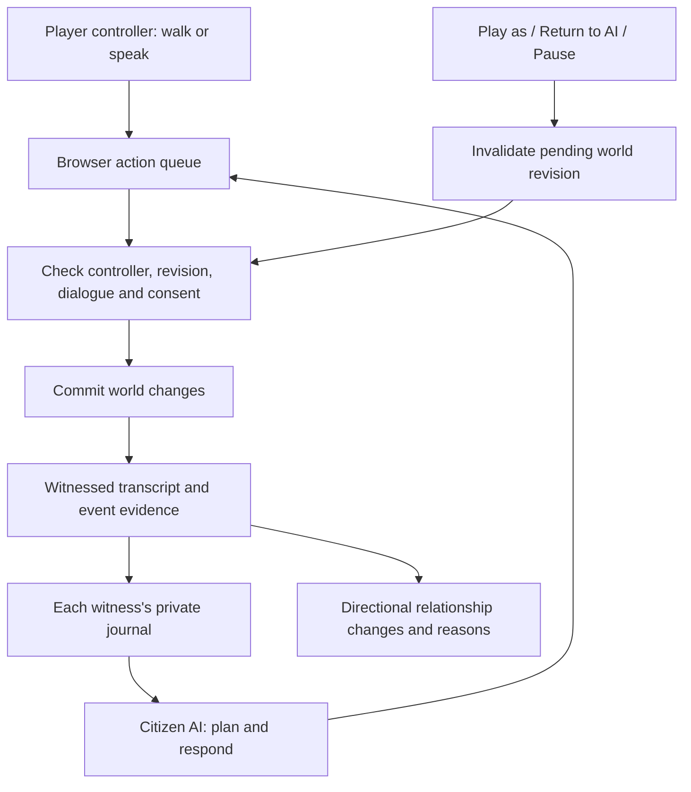
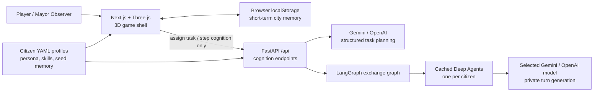
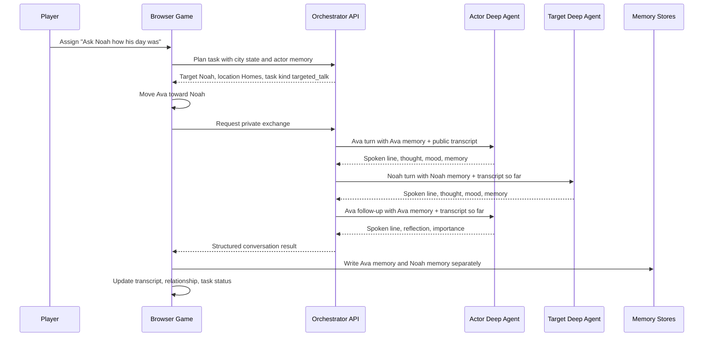
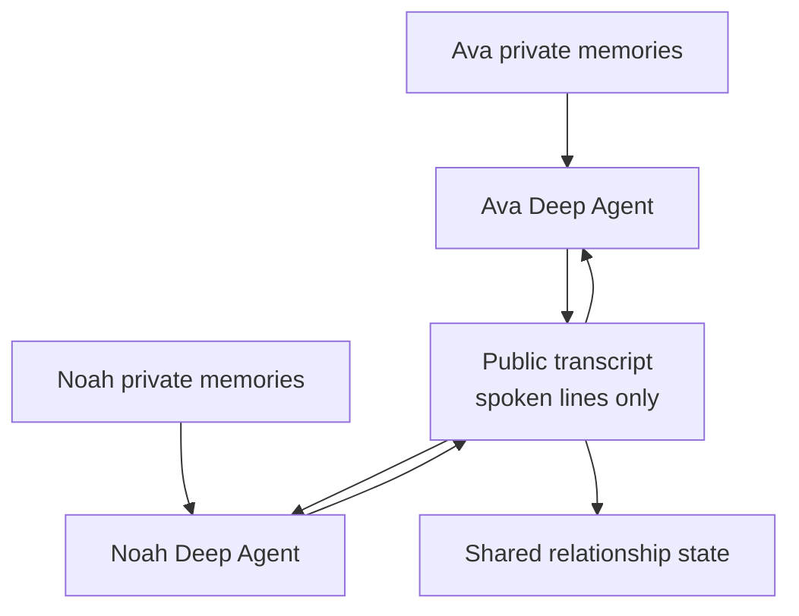

# AgentCity

AgentCity is a playable 3D AI city simulation where citizens are autonomous agents with daily routines, needs, money, relationships, memory, and goals. Explore a cel-shaded neighborhood with animated citizens, blossom trees, shopfronts, a market, a schoolyard, and a riverside. The current MVP has eight active student agents, including newcomers Sophie Laurent, Zara Ali, and Eliot Chen. Other citizen profiles remain inactive in the codebase.

**Follow what you start.** Every situation, action or election you create becomes a
**Happening now** story: the reaction plays straight away, and the card on the map
collects each beat (who went to whom, what they said, what changed) with **Watch** and
**Replay talk**. News lists all running stories. A student-council election is one of
these situations: pick two candidates in Create and watch them campaign, or play a
student to question the candidates and cast your own secret ballot. See [event gameplay and architecture](docs/events.md).

This repo is `ai-agent-city-game`. The visible product name is `AgentCity`.

Deployment URL: [ai-agent-city-game.vercel.app](https://ai-agent-city-game.vercel.app). Hosting remains paused; use local setup to play this revision.

## Play This Version

- **Explore the town:** drag to orbit, scroll to zoom, and right-drag to pan. On a phone, use one finger to orbit and two fingers to pan/pinch. Follow tracks the selected citizen; Town overview frames the neighborhood. Tap a character or their name to select them.
- **Citizens:** select anyone from the portrait strip or roster. Life, Memories, and Bonds have independently scrollable content.
- **Play as:** take over a citizen, choose a destination, then open Talk and speak in your own words to someone at that location. Only the other citizen's reply is generated. Return to AI whenever you want.
- **Manual:** assign a task to a citizen or move your controlled citizen. The world pauses when work ends or needs a decision.
- **Auto:** routines and occasional conversations run while the tab is visible. Pause always remains available, including during an AI request.
- **Talk:** chronological dialogue with speaker/recipient names and task separators. Scroll back without being dragged to the latest message. Use the citizen filter to follow one person's story.
- **Bonds:** directional trust and warmth, with reasons and a history of changes. Repeated greetings do not automatically create friendship.
- **A real week:** day 1 is a Monday. Students go to school on weekdays, eat breakfast and dinner at home and lunch at school, join hobby clubs on Tuesday and Thursday afternoons (lab, library, farm, cafe kitchen or park, depending on their skills) and follow their hobbies at the weekend. Everyone gets $15 pocket money each Monday.
- **Badges:** 14 goals reward trying every part of the game, such as your first conversation, playing as someone, exploring five places, seeing a friendship form or finishing an election. Open Badges to see how to earn them.
- **New players:** a short guide appears on the first visit and reopens from the ? button.
- **A real Tokyo neighbourhood:** Nakameguro, on real Tokyo time, date and weather, with the cherry-lined Meguro River, the elevated Tōyoko line and trains, buses driving on the left, shops, offices, a shrine and a clinic. See [Nakameguro](docs/nakameguro.md).
- **Natural conversations:** every resident has their own natural AI voice, lips that move with the audio, and gestures that fit what they say. Chats as a resident are continuous and happen where you stand, and plans you agree on can be saved. See [conversations, voices and body language](docs/conversations.md).
- **Play god and take action:** Create changes the weather or sets up situations (dropped money, fires, accidents, love, rivalries, a school election) and shows the reaction right away. Act lets any resident hug, help, argue with, slap or ask out any other, and everyone reacts in character.
- **Real lives:** 18 residents in eight families: students, working parents, a grandfather and, soon, a baby. Everyone ages a day per city day and has a body, feelings, a job or school grades, money, ambitions, health problems, family and love. Babies are born, people get sick and recover, and people can die of old age. See [life simulation](docs/life-simulation.md).
- **One game for everyone:** adults, kids and families play the same game. Romance is only between adults; conflict is non-graphic and never between adults and children.
- **Safety:** player-written text is checked before it reaches the AI. Phone numbers, emails, addresses, passwords, links and unkind language are blocked with a friendly explanation, and messages about self-harm point to a trusted adult. Every model prompt carries child-safety rules. See [releasing for kids](docs/kids-release.md).

Your world resumes in the same browser through localStorage. Save downloads a JSON snapshot for inspection/backup; importing snapshots and cross-device saves are not implemented. Closing or hiding the tab stops new simulation work. An already-sent provider request may still finish and incur charges; interrupted results are discarded.

## License

AgentCity is released under the [PolyForm Noncommercial License 1.0.0](LICENSE).
You may use, modify, and distribute it for non-commercial purposes. Commercial
use requires a separate commercial license from the project owner.

## Stack

- Frontend: Next.js, React, Three.js, PathFinding.js, Tailwind, shadcn-style primitives, Zustand
- Backend: FastAPI, Pydantic, SQLAlchemy
- Agent runtime: LangGraph + Deep Agents for private citizen exchange orchestration
- Realtime: WebSocket
- Memory store: browser short-term session memory by default, optional cloud Postgres + pgvector for durable memory
- LLM: Gemini or OpenAI, selected explicitly with `LLM_PROVIDER`; structured planning plus provider-backed Deep Agent turns
- Embeddings: optional OpenAI embeddings in OpenAI mode; Gemini mode uses text journals without embedding requests

## Autonomy Direction

AgentCity uses a Hermes-inspired loop: citizens collect observations, retrieve memories, reason selectively, form plans, talk to nearby citizens, and write new memories back into the city. The linked Hermes Agent project is a useful reference for self-improving agents with persistent memory, skill learning, cross-session recall, scheduled automations, and subagents.

The task/conversation path uses LangGraph private exchange nodes and a cached Deep Agent graph per citizen. The listener does not receive the initiator's private observations, task, or event context. Both participants retain the complete witnessed dialogue, explicitly marking spoken claims as unverified reports. These boundaries reduce hallucinations but cannot guarantee every model response is factually correct.

AI exchanges can continue beyond a single reply and end naturally, with a six-line limit. Player-led exchanges generate one reply and then return control to the player. A companion journey requires explicit acceptance; unresolved requests are not reported as completed. Each Deep Agent turn has a three-model-call run limit and provider timeout. This is not an account-wide spending cap.

Manual Mode is the easiest way to follow the game: the city waits, the player assigns one student task, the task runs, conversations/memories are written, and the city pauses when the task completes. Autonomous Mode starts the living-city loop: students follow routines, meet naturally, LLM cognition can generate conversations, and relationships shift from strangers to acquaintances to friends over time.

## How Agents Interact

Each citizen is both a visible game entity and a private AI actor. The game engine
handles mechanical state: clock ticks, map movement, location arrival, task status,
relationship scores, and memory writes. The AI layer handles cognition: deciding
who to approach, what to say, what the exchange means, and what each participant
remembers afterward.

The important rule is memory isolation. A citizen never receives another citizen's
private memory file. When Ava talks to Noah, Ava can use Ava's memories and the
public transcript. Noah can use Noah's memories and the same transcript. New facts
move through spoken lines, not hidden prompt leakage.

For a manual player task, the flow is:

1. Player assigns a natural-language task to one citizen.
2. The orchestrator asks the selected LLM to turn the task into a plan: task kind, target
   citizens, route/location, and a player-visible summary.
3. The browser simulation moves the actor toward the selected target or location.
4. When the actor is ready, LangGraph runs the conversation as private turn nodes.
5. Each turn invokes that speaker's cached Deep Agent with tools for only that
   speaker's memory, current task, and allowed high-level city actions.
6. The structured response returns spoken text, private thought, mood, memory,
   reflection, and importance.
7. The game writes separate memories for each participant, updates relationships,
   appends transcript lines, and checks the reported task outcome. An unresolved request remains unresolved rather than being marked completed just because people spoke.

### Player Control And Social Consequences


```mermaid
flowchart TD
  Player[Player controller: walk or speak] --> Commands[Browser action queue]
  AI[Citizen AI: plan and respond] --> Commands
  Commands --> Check[Check controller, revision, dialogue and consent]
  Check --> World[Commit world changes]
  World --> Evidence[Witnessed transcript and event evidence]
  Evidence --> Private[Each witness's private journal]
  Evidence --> Bonds[Directional relationship changes and reasons]
  Private --> AI
  Switch[Play as / Return to AI / Pause] --> Revision[Invalidate pending world revision]
  Revision --> Check
```

## Scope And Release Gates

This revision is a local-first, single-player early-access game, not a production multiplayer service. Player takeover is supported in browser memory mode. The optional server simulation still exists and does not yet share one engine with the browser. Deep Agent graphs are cached, but agent thread checkpoints, learned executable skills, and durable cross-device memories are not implemented; memories are explicitly supplied by the world on each turn.

Before resuming public hosting: add authenticated per-world ownership, server-enforced request/token quotas, persistent saves with import/recovery, and longer scenario evaluations. Do not treat a cached Deep Agent or a prompt as a privacy/security boundary against a malicious client. The current browser owns and can inspect its entire local world. Keep Vercel paused until those hosting controls are reviewed.

## Architecture Diagrams

### Runtime Architecture


```mermaid
flowchart LR
  Player["Player / Mayor Observer"]
  Browser["Next.js + Three.js\n3D game shell"]
  LocalMemory["Browser localStorage\nshort-term city memory"]
  Api["FastAPI /api\ncognition endpoints"]
  Planner["Gemini / OpenAI\nstructured task planning"]
  LangGraph["LangGraph exchange graph"]
  DeepAgents["Cached Deep Agents\none per citizen"]
  TurnLLM["Selected Gemini / OpenAI model\nprivate turn generation"]
  Profiles["Citizen YAML profiles\npersona, skills, seed memory"]

  Player --> Browser
  Browser <--> LocalMemory
  Browser -->|"assign task / step cognition only"| Api
  Api --> Planner
  Api --> LangGraph
  LangGraph --> DeepAgents
  DeepAgents --> TurnLLM
  Profiles --> Browser
  Profiles --> Api
```

### Manual Task Conversation


```mermaid
sequenceDiagram
  participant P as Player
  participant UI as Browser Game
  participant O as Orchestrator API
  participant A as Actor Deep Agent
  participant B as Target Deep Agent
  participant M as Memory Stores

  P->>UI: Assign "Ask Noah how his day was"
  UI->>O: Plan task with city state and actor memory
  O-->>UI: Target Noah, location Homes, task kind targeted_talk
  UI->>UI: Move Ava toward Noah
  UI->>O: Request private exchange
  O->>A: Ava turn with Ava memory + public transcript
  A-->>O: Spoken line, thought, mood, memory
  O->>B: Noah turn with Noah memory + transcript so far
  B-->>O: Spoken line, thought, mood, memory
  O->>A: Ava follow-up with Ava memory + transcript so far
  A-->>O: Spoken line, reflection, importance
  O-->>UI: Structured conversation result
  UI->>M: Write Ava memory and Noah memory separately
  UI->>UI: Update transcript, relationship, task status
```

### Memory Boundary


```mermaid
flowchart TB
  AvaMemory["Ava private memories"]
  NoahMemory["Noah private memories"]
  Transcript["Public transcript\nspoken lines only"]
  AvaAgent["Ava Deep Agent"]
  NoahAgent["Noah Deep Agent"]
  Relationship["Shared relationship state"]

  AvaMemory --> AvaAgent
  Transcript --> AvaAgent
  NoahMemory --> NoahAgent
  Transcript --> NoahAgent
  AvaAgent --> Transcript
  NoahAgent --> Transcript
  Transcript --> Relationship
```

## Local Setup

1. Copy environment variables:

```bash
cp .env.example .env
```

2. Optional: create a cloud Postgres database.

The default `MEMORY_STORAGE=short_term` runs without Neon. On Vercel, the browser owns the active short-term play session in localStorage so task assignment, ticks, memories, and conversations stay consistent even when serverless functions cold start. For durable memory later, set `MEMORY_STORAGE=postgres` and provide `DATABASE_URL` or `NEON_DATABASE_URL`. See [docs/cloud-database.md](docs/cloud-database.md).

3. Backend:

```bash
cd backend
uv venv
uv pip install -e ".[dev]"
uv run uvicorn app.main:app --reload --host 0.0.0.0 --port 8000
```

4. Frontend:

```bash
cd frontend
npm install
npm run dev
```

Open [http://localhost:3000](http://localhost:3000).

## LLM Modes

`LLM_MODE=real` uses the provider selected by `LLM_PROVIDER`. The example configuration uses `LLM_PROVIDER=gemini`, `GEMINI_MODEL=gemini-3.5-flash-lite`, and a backend-only `GEMINI_API_KEY`. Gemini uses the Google GenAI SDK for structured planning and `ChatGoogleGenerativeAI` inside Deep Agents for private turns. `LLM_PROVIDER=openai` instead uses `OPENAI_API_KEY` and `OPENAI_MODEL` (default `gpt-4.1-nano`). No automatic provider fallback occurs, even if both keys are present.

Citizen tasks do not use template fallbacks: missing credentials, provider errors, and quota exhaustion block the action rather than inventing success. Free-tier eligibility and quotas are controlled by Google, not by the app. See [Gemini setup and privacy notes](SETUP.md#gemini-setup). `/health` reports the configured provider/model without exposing credentials; it is not a live key-validity check.

The city engine still owns mechanical simulation work such as ticks, rendering, path movement, browser state, and persistence so the game remains stable and affordable.

The default cognition limits are:

```bash
MAX_LLM_CALLS_PER_TICK=2
MAX_CONVERSATIONS_PER_TICK=1
LLM_COGNITION_INTERVAL_TICKS=4
ACTIVE_CITIZEN_IDS=profile
```

Set `ACTIVE_CITIZEN_IDS=all` to activate the full seeded city later, or provide a comma-separated list to choose a custom playable cast. `profile` uses the citizens marked `active: true` in `backend/app/citizens/profiles/*.yaml`.

## Adding Citizens

Each citizen has a dedicated YAML persona file in `backend/app/citizens/profiles/`. Add a new citizen by creating one file with the citizen id, persona, schedule, skills, seed memories, and relationships. Runtime memories are stored per citizen in browser short-term memory or the configured database so they grow independently without rewriting deployment files. See [docs/citizens.md](docs/citizens.md).

## Database

AgentCity does not require Neon for V1. By default the playable game uses browser short-term session memory and the backend only seeds the city plus handles optional cognition calls. This avoids hosted database quota failures and avoids relying on Vercel `/tmp` persistence across requests.

For durable memory, set `MEMORY_STORAGE=postgres` and provide Supabase, Neon, or another hosted Postgres URL through `DATABASE_URL`. In Postgres mode, startup enables pgvector with `CREATE EXTENSION IF NOT EXISTS vector`, creates the SQLAlchemy tables, and seeds Nakameguro if empty. Redis remains optional future infrastructure and is not required for V1 gameplay.

## Core Gameplay

- Watch eight student agents move through a 3D neighborhood.
- Tap or click any student to see thoughts, memory, relationships, mood, needs, money, schedule, and goals.
- Use Manual Mode to assign a focused natural-language task to any student; the citizen decides who to approach and how to answer.
- Use Autonomous Mode to trigger city events such as flu outbreak, traffic accident, food shortage, school exam, festival, bank policy change, and power outage.
- Change mayor policies for tax, hospitals, school funding, roads, farming subsidies, and public health in Autonomous Mode.
- Observe WebSocket-streamed thoughts, conversations, memories, reflections, and city metrics.
- Play from desktop or mobile; the UI stacks the city map, citizen panel, roster, and story feed on smaller screens.

## How To Play

1. Start in `Manual`.
2. Tap Ava, Mateo, Noah, Iris, or Leo on the map to follow one student.
3. Use `Give [name] a task`, type what you want, and click `Assign Task`; the citizen chooses the target and route.
4. Open `Talk` to read the latest conversation as a transcript.
5. Let the task finish automatically, or use `Pause` / `Close Task`.
6. Switch to `Auto` when you want the students to move, meet, talk, and react without direct player instructions.

## Verification

Backend tests:

```bash
cd backend
uv run pytest
```

Frontend checks:

```bash
cd frontend
npm run lint
npm run build
```
