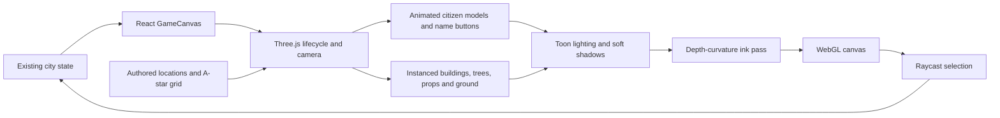

# Nakameguro In 3D

Nakameguro is rendered as real, orbitable Three.js geometry, not an illustrated image on a plane. Its art direction takes inspiration from [Sakura Crossing](https://github.com/Kenton-GMI/sakura-crossing) by Kenton Wang (MIT): cohesive low-poly geometry, stepped lighting, warm sunlight, and restrained ink outlines. AgentCity's town geometry, characters, textures, and shader implementation are original; no Sakura Crossing code or assets are bundled.

## Controls

- Drag with the left mouse button to orbit; right-drag to pan; scroll to zoom.
- On touchscreens, one finger orbits and two fingers pan/pinch.
- Tap a citizen model or its name, or choose a portrait from the roster.
- Follow tracks the selected citizen. Explore releases the camera.
- The overview button frames the town; rotate turns the camera by 45 degrees.
- Place labels toggles additional destination names. Building signs remain visible.
- At town-wide zoom, only the selected citizen's name remains visible to avoid label clutter. The portrait roster always provides access to every citizen.
- Nameplates start with an icon for the resident's current activity (💤 sleeping, 📚 school, 💬 talking, 🔬 lab club and so on). Residents asleep at home go indoors; their nameplate stays at the front door.
- Movement and conversation commands remain in the citizen and Talk panels. Camera gestures do not issue citizen tasks.

## Rendering Architecture

`frontend/src/game/three/` owns the scene:

- `layout.ts`: authored building footprints and destination arrivals; PathFinding.js A-star navigation with no diagonal corner cutting.
- `materials.ts`: shared toon materials, geometry, procedural signage, and texture ownership.
- `town.ts`: buildings, rooftops, windows, awnings, garden boxes, market produce, benches, lamps, bikes, schoolyard, pond, river, bridges, and drifting petals.
- `citizen.ts`: distinct palette-based student models, walking cycles, idle motion, selection rings, and accessible DOM name buttons.
- `ink-pass.ts`: depth-based crease outlines, tone mapping, and output color conversion.
- `renderer.ts`: camera, lighting, selection, resizing, visibility, frame budget, and cleanup.

## Simulation Boundary

The existing 40-by-40 simulation remains authoritative. The renderer maps location arrivals to public entrances and interpolates citizen motion over a separate half-tile navigation grid. Buildings and the park pond block visual paths; decorative props do not all have collision volumes. This is presentation navigation, not a physics or pedestrian-avoidance simulation. Animation can finish after a logical tick; it does not advance city time or alter task completion. This boundary lets existing saves, plans, private memory, and conversations continue to work.

Lighting follows the simulation clock through a colour script in `sky.ts`: peach sunrise, blue day, golden hour, lavender dusk and deep-blue night. The sun arcs from the river (east) to the west, and the sky eases between 15-minute ticks instead of jumping. After dark, `atmosphere.ts` lights window glass and street lamps with emissive materials, adds soft lamp light pools, stars and a moon. None of these are real lights, so night costs almost nothing. Clouds drift and cast moving shadows by day.

`traffic.ts` runs a yellow school bus and two cars in the right-hand lane around the central block. The bus pauses at the bus shelter. Every vehicle stops for pedestrians in front of it and queues behind the vehicle ahead. Traffic is decorative: it never blocks simulation movement, and it stays parked when reduced motion is on.

Blossom petals, clouds, river ripples and traffic are visual effects, not weather or transport simulation. Interiors and Blender/glTF asset loading are not implemented in this revision.

## Performance And Compatibility

The renderer targets 30 frames per second, caps device pixel ratio, shares materials and geometry, and instances repeated static meshes. It stops rendering when the tab is hidden or the game leaves the viewport. Reduced-motion preferences disable decorative motion and gait bobbing, while necessary travel remains visible. Resize observers, controls, listeners, textures, shadow targets, instanced buffers, and render targets are disposed on unmount.

WebGL 2 is required. A visible error state replaces a blank canvas when graphics initialization fails. There are no new environment variables or runtime art downloads. The scene renders on the player's device and does not create backend or LLM requests; public hosting remains paused.

Run `npm test`, `npm run typecheck`, `npm run lint`, and `npm run build` in `frontend/`. Navigation tests cover every pair of public destinations, obstacles, boundary clamping, corner cutting, repeated searches, and distinct home positions. Browser verification should also cover desktop and mobile orbit/zoom, name selection, player walking, conversation submission, and a nonblank moving canvas.
